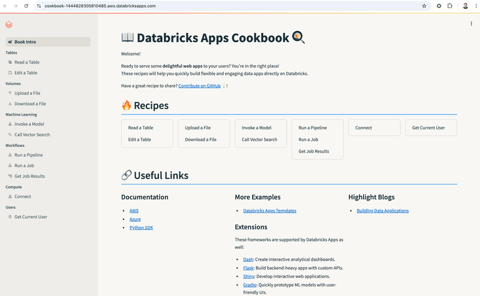
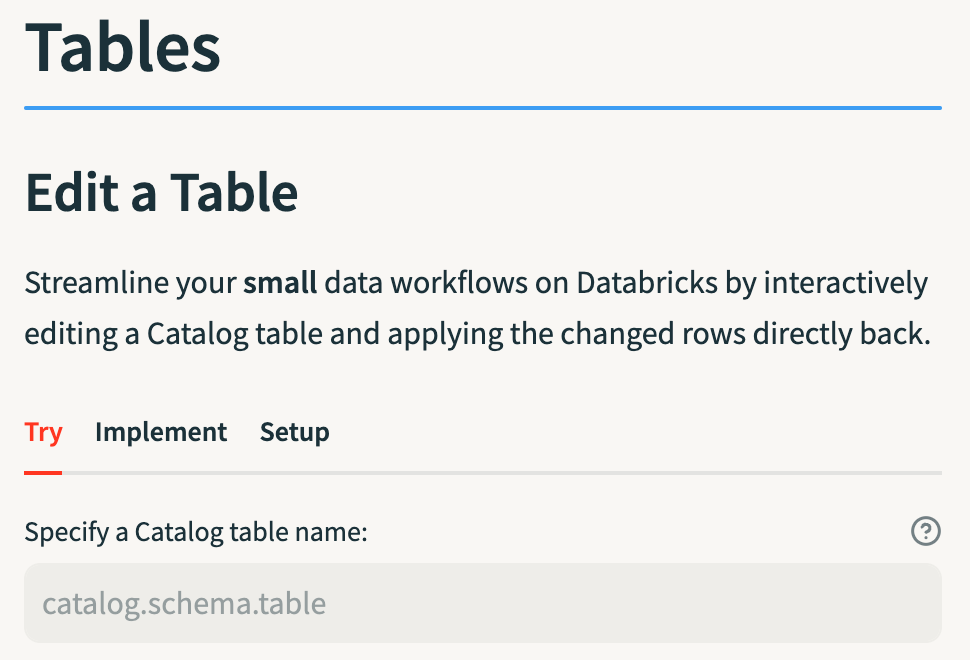

## 📖 Databricks Apps Cookbook

This cookbook provides reusable examples for building interactive data [Apps](https://docs.databricks.com/en/dev-tools/databricks-apps/index.html) on Databricks. [Streamlit](https://streamlit.io/)'s pre-built Python components simplify creating intuitive interfaces for data exploration and operations:

With these recipes, you’ll learn how to:
- **Connect UIs to Databricks resources** like workflows, pipelines, users, and volumes.  
- **Interact and edit** tables in-app for real-time data manipulation.  
- **Extend** examples to other Apps-supported frameworks, like Dash, Flask, Gradio, and Shiny.  

We encourage you to **combine examples**—such as triggering workflows when a table is edited.

### 🍳 Instructions
1. [Fork this repo](https://docs.github.com/de/pull-requests/collaborating-with-pull-requests/working-with-forks/fork-a-repo).
2. [Load the repo as a Databricks Git folder](https://docs.databricks.com/en/repos/index.html).
3. Deploy the cookbook App:
   - Use the _Custom_ option in the [Databricks Apps UI](https://docs.databricks.com/en/dev-tools/databricks-apps/app-development.html#how-do-i-create-an-app-in-the-databricks-apps-ui), or  
   - Deploy via [Databricks CLI](https://docs.databricks.com/en/dev-tools/databricks-apps/get-started.html#step-4-deploy-the-app-to-your-workspace).
4. Review the **Setup** tab for any recipe you wish to try as some recipes require additional steps before running. 
5. Once ready, explore the **Try** tab for a user-facing implementation or dive into the **Implement** tab for full integration code with extension references:

### 📂 Repo Structure
- `assets`: Static files such as images
- `views`: Python scripts defining app pages
- `view_groups.py`: `views` grouped for navigation and the home page
- `app.yaml`: Environment variables and App settings
- `requirements.txt`: Python dependencies

### 🤝 Contributions
We welcome contributions! Submit a pull request to fix issues or add features. For ideas, check the **Roadmap**.

### 🗺️ Roadmap
- Add an example for Genie API integration.
- Create workflows for vector embedding and querying.
- Implement interactive data dashboards.
- Implement an ML monitoring dashboard.
- Add tests.
- Include advanced error-handling examples.
- Improve type annotations.